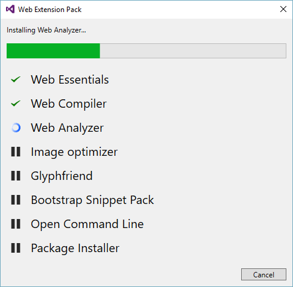

## Web Extension Pack
A Visual Studio extension that installs a short list of
highly valuable extensions targeted web development.

Download the extension at the
[VS Gallery](https://visualstudiogallery.msdn.microsoft.com/384892a5-7b67-42f2-b7de-574ef254a02a)
or get the
[nightly build](http://vsixgallery.com/extension/92e3e73b-510f-45bb-8aee-c637e83778b3/)

------------------------------------

### Extensions
After installing the Web Extension Pack and restarting
Visual Studio, the following extensions will be installed:

- [Web Essentials 2015](https://visualstudiogallery.msdn.microsoft.com/ee6e6d8c-c837-41fb-886a-6b50ae2d06a2)
- [Web Compiler](https://visualstudiogallery.msdn.microsoft.com/3b329021-cd7a-4a01-86fc-714c2d05bb6c)
- [Web Analyzer](https://visualstudiogallery.msdn.microsoft.com/6edc26d4-47d8-4987-82ee-7c820d79be1d)
- [Image Optimizer](https://visualstudiogallery.msdn.microsoft.com/a56eddd3-d79b-48ac-8c8f-2db06ade77c3)
- [Glyphfrind](https://visualstudiogallery.msdn.microsoft.com/5fd24afb-b3b2-4cec-9b03-1cfcec6123aa)
- [Bootstrap Snippet Pack](https://visualstudiogallery.msdn.microsoft.com/e82e7862-f731-4183-a27a-3a44b261bfe5)
- [Open Command Line](https://visualstudiogallery.msdn.microsoft.com/4e84e2cf-2d6b-472a-b1e2-b84932511379)
- [Package Installer](https://visualstudiogallery.msdn.microsoft.com/753b9720-1638-4f9a-ad8d-2c45a410fd74)

### Installing
It doesn't take long to install the extensions. Probably less
than a minute.

When installation is done you will be prompted to restart
Visual Studio. After the restart, all the extensions are
fully functional and ready to use.